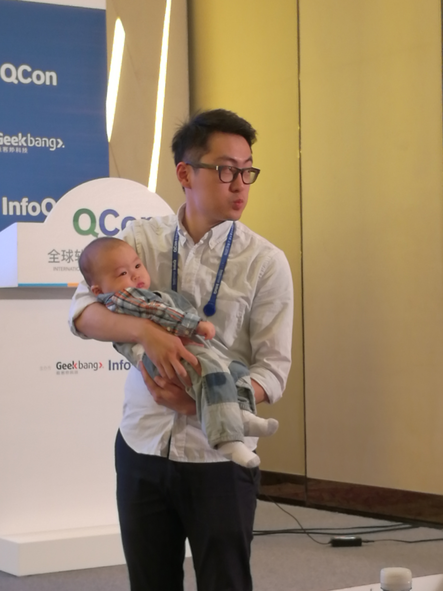
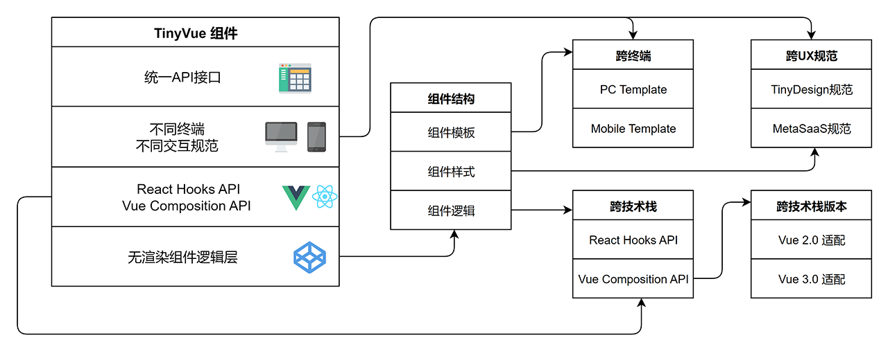
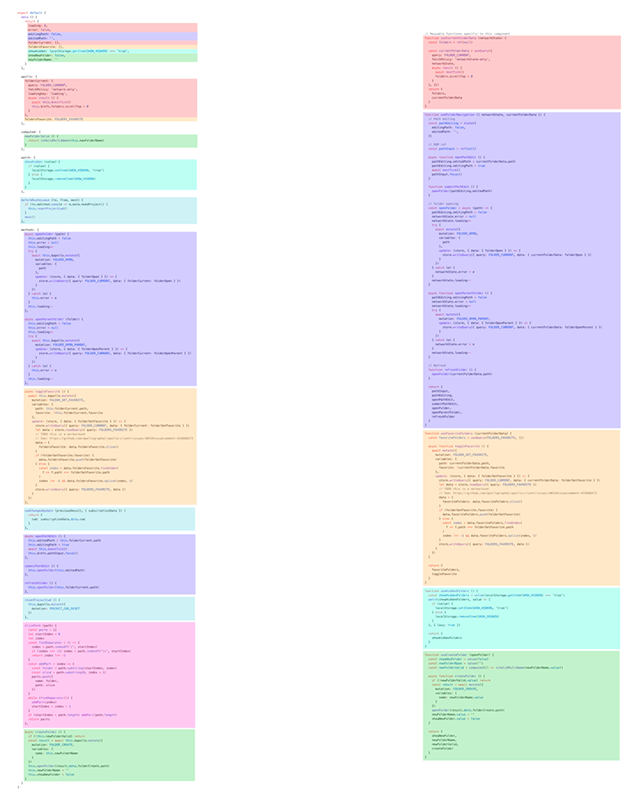
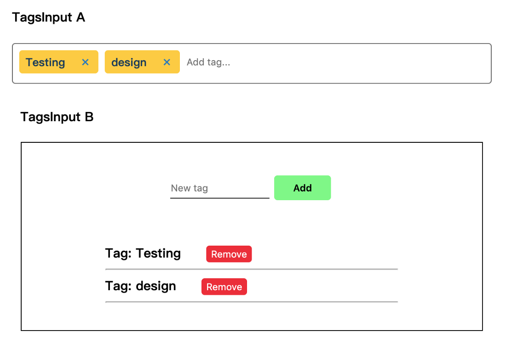
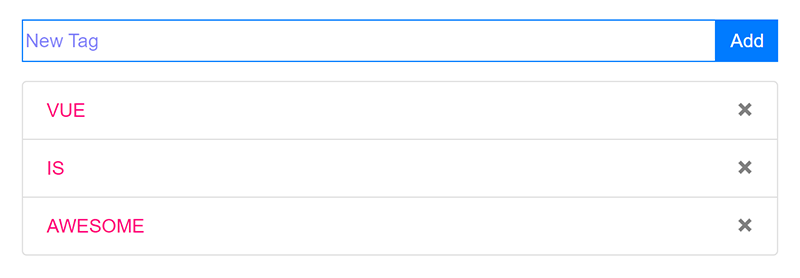
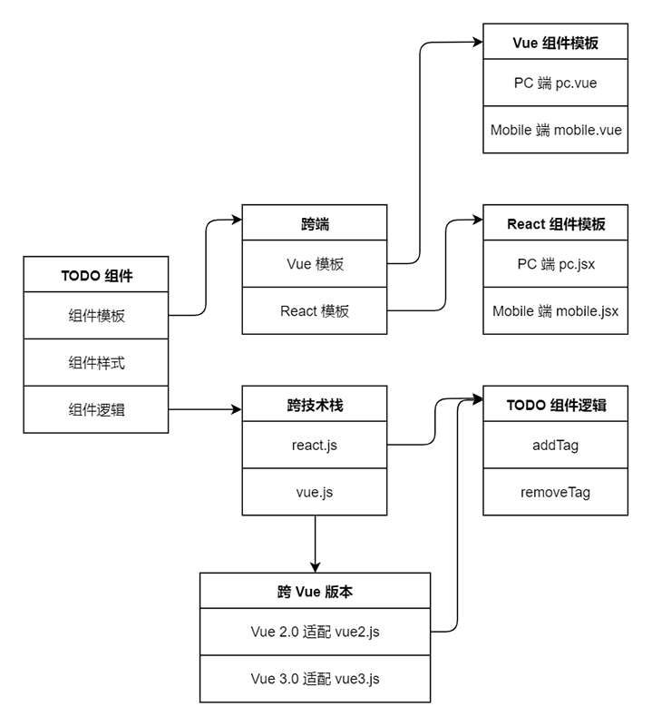

# **TinyVue：与 Vue 交往八年的组件库**

## **VueConf 2024 深圳**

去年因故停办的 VueConf，今年如约在深圳举行。作为东道主 & 上届 VueConf 讲师的我，没有理由不来凑个热闹。大会结束后，我见裕波在朋友圈转发 Jinjiang 的文章《我和 Vue.js 的十年》，我就在下面打趣道：“过两年我也写篇同名文章”，然后裕波回复：“先写一个我和 Vue 的八周年”。我寻思，我的十分钟闪电演讲，有人吐槽没有干货，比如同时支持 Vue2 和 Vue3 的技术细节，不如就利用这个机会，给闪电演讲打个补丁。

## **QCon 2016 上海**

时间先回到 2014 年，彼时的我刚加入华为公共技术平台部，参与 HAE 前端框架的研发。HAE 的全称是 Huawei Application Engine，即华为应用引擎。当时我们部门负责集团 IT 系统的基础设施建设。

作为云开发平台，HAE 需要支持全面的云化：云端开发、云端测试、云端部署、云端运营，以及应用实施的云化。其中，云端开发由 Web IDE 负责实现，这个 IDE 为用户提供基于配置的前端开发能力，因此需要支持可配置的 HAE 前端框架。

在 2014 年，主流的前端技术仍以 jQuery 为主。传统的 jQuery 开发方式是通过手动操作 DOM 元素来更新和响应数据的变化。开发者需要编写大量的代码来处理数据和 DOM 之间的同步。这种单向的数据流和手动操作的方式，会导致代码冗余、维护困难。

在 HAE 前端框架的研发初期，为了引入数据双向绑定功能，我们在原本基于 jQuery 的架构上融合了 AngularJS 框架。然而，经过几个月的尝试，我们发现这种融合方式存在两个严重问题：首先，当页面绑定数据量较大时，性能显著下降。其次，框架同时运行两套生命周期，导致两者难以协调相互同步。

因此，我们决定移除 AngularJS 框架，但又不想放弃已经使用的数据双向绑定的特性。用什么方案替换 AngularJS 的数据双向绑定，并且还要保证性能优于脏读机制？当时我们把目光投向 ES5 的 Object.defineProperty 函数，借助它的 getter 和 setter 方法实现了数据双向绑定。这个方案比 Vue 框架早了整整一年，直到 2015 年 10 月，Vue 1.0 才正式发布。

2016 年 10 月，我加入华为后参与建设的 HAE 前端框架进入第三个年头。当时我们内部使用的前端技术仍以 jQuery 为主，作为前端架构负责人，我在考察 Angular、React、Vue 三个新兴框架，然后选择其中一个作为 HAE 后续的技术演进方向。于是我来到了上海，参加 QCon 全球软件开发大会。那时，尤雨溪给我的第一印象是这样的：



后来，我们选择了 Vue，虽然当时的 Vue 一如他怀里没长大的娃，我们依旧选择相信他，相信 Vue 会有更亮眼的未来。

### **VueConf 2017 波兰**

从 QCon 回来后不久，我们提交了 Vue 与 React 的对比分析报告并作了汇报。2017 年初，我们已经开始深入研究 Vue 替换 HAE 底层框架的可行性。因为在 HAE 我们已经实现了 Vue 的能力，比如数据双向绑定、生命周期管理、路由管理、模块化管理等等，然后在这个基础上用面向对象的方式构建了一套企业级组件库。

使用 Vue 进行重构，就是把底层框架的能力用 Vue 替换，然后上层的组件库再迁移到 Vue。这个过程是相当磨人的，中间遇到各种问题，包括 Webpack 构建工具对于当时的我们都是新鲜事物。我们急需专业指导，急需一个信心，然后，首届 VueConf 就来了。

后来我从裕波那里得知，首届 VueConf 是 2017 年 5 月在北京举办的，而我去的波兰 VueConf 是 6 月份。但没关系，当我看到电影院现场座无虚席，一群全世界各个国家来的 Vue 开发者汇聚一堂，已经给了我很大的信心。当时的讲师阵容是这样的：


### **VueConf 2019 荷兰**

经过近半年的研发，HAE 组件库成功迁移到 Vue 框架，并于 2017 年 12 月正式发布。在 2018 年，为统一用户体验遵循 Aurora 主题规范，我们对组件库进行升级改造，并改名为 AUI。在支撑了制造、采购、供应、财经等领域的大型项目后，到了 2019 年 AUI 进入成熟稳定期，我们才有时间去思考如何将 jQuery 的 30 万行代码重构为 Vue 的代码。

与此同时，Vue 在这两年里也得到长足的发展。2019 年我再次参加海外的 VueConf，地点已经由波兰移至荷兰，从电影院升级成大剧院，舞台变得更豪华了。不变的是台上的尤雨溪，幻灯片的内容一直保持朴素的风格：


## **全新架构的 TinyVue 组件库**

2019 年 5 月 16 日，美国商务部将华为列入出口管制“实体名单”，我们面临前所未有的困难，保证业务连续性成为我们首要任务。我们要做最坏的打算，如果有一天所有的主流前端框架 Angular、React、Vue 都不能再继续使用，那么重构后的 Vue 代码又将何去何从？

因此，我们组件的核心代码要与主流前端框架解耦，这就要求我们不仅仅要重构代码，还要重新设计架构。经过不断的打磨和完善，拥有全新架构的 TinyVue 组件库逐渐浮出水面，以下就是 TinyVue 组件的架构图：



在这个架构下，TinyVue 组件有统一的 API 接口，开发人员只需写一份代码，组件就能支持不同终端的展现，比如 PC 端和 Mobile 端，而且还支持不同的 UX 交互规范。借助 React 框架的 `Hooks API` 或者 Vue 框架的 `Composition API` 可以实现组件的核心逻辑代码与前端框架解耦，甚至实现一套组件库代码，同时支持 Vue 的不同版本。

接下来，我们先分析开发组件库面临的问题，再来探讨面向逻辑编程与无渲染组件，最后以实现一个 TODO 组件为例，来阐述我们的解决方案，通过示例代码展现我们架构的四个特性：跨技术栈、跨技术栈版本、跨终端和跨 UX 规范。

其中，跨技术栈版本这个特性，已经为华为内部 IT 带来巨大的收益。由于 Vue 框架最新的 3.0 版本不能完全向下兼容 2.0 版本，而 2.0 版本又将于 2023 年 12 月 31 日到达生命周期终止（EOL）。于是华为内部 IT 所有基于 Vue 2.0 的应用都必须在这个日期之前升级到 3.0 版本，这涉及到几千万行代码的迁移整改，正因为我们的组件库同时支持 Vue 2.0 和 3.0，使得这个迁移整改的成本大大降低。

### **开发组件库面临的问题**

目前业界的前端 UI 组件库，一般按其前端框架 Angular、React 和 Vue 的不同来分类，比如 React 组件库，Angular 组件库、Vue 组件库，也可以按面向的终端，比如 PC、Mobile 等不同来分类，比如 PC 组件库、Mobile 组件库、小程序组件库等。两种分类交叉后，又可分为 React PC 组件库、React Mobile 组件库、Angular PC 组件库、Angular Mobile 组件库、Vue PC 组件库、Vue Mobile 组件库等。

比如阿里的 [Ant Design](https://ant.design/) 分为 PC 端：`Ant Design of React`、`Ant Design of Angular`、`Ant Design of Vue`，Mobile 端：`Ant Design Mobile of React`（官方实现）`Ant Design Mobile of Vue`（社区实现）。

另外，由于前端框架 Angular、React 和 Vue 的大版本不能向下兼容，导致不同版本对应不同的组件库。以 Vue 为例，Vue 2.0 和 Vue 3.0 版本不能兼容，因此 Vue 2.0 的 UI 组件库跟 Vue 3.0 的 UI 组件库代码是不同的，即同一个技术栈也有不同版本的 UI 组件库。

比如阿里的 [Ant Design of Vue](https://www.antdv.com/) 其 1.x 版本 for Vue 2.0，而 3.x 版本 for Vue 3.0。再比如饿了么的 Element 组件库，[Element UI](https://element-plus.org/) for Vue 2.0，而 [Element Plus](https://element-plus.org/) for Vue 3.0。

我们将上面不同分类的 UI 组件库汇总在一张图里，然后站在组件库使用者的角度上看，如果要开发一个应用，那么先要从以下组件库中挑选一个，然后再学习和掌握该组件库，可见当前多端多技术栈的组件库给使用者带来沉重的学习负担。


这些 UI 组件库由于前端框架不同、面向终端不同，常规的解决方案是：不同的开发人员来开发和维护不同的组件库，比如需要懂 Vue 的开发人员来开发和维护 Vue 组件库，需要懂 PC 端交互的开发人员来开发和维护 PC 组件库等等。

很明显，这种解决方案首先需要不同技术栈的开发人员，而市面上大多数开发人员只精通一种技术栈，其他技术栈则只是了解而已。这样每个技术栈就得独立安排一组人员进行开发和维护，成本自然比单一技术栈要高得多。另外，由于同一技术栈的版本升级导致的不兼容，也让该技术栈的开发人员必须开发和维护不同版本的代码，使得成本进一步攀升。

面对上述组件开发和维护成本高的问题，业界还有一种解决方案，即以原生 JavaScript 或 Web Component 技术为基础，构建一套与任何开发框架都无关的组件库，然后再根据当前开发框架流行的程度，去适配不同的前端框架。比如 [Webix](https://webix.com/) 用一套代码适配任何前端框架，既提供原生 JavaScript 版本的组件库，也提供 Angular、React 和 Vue 版本的组件库。

这种解决方案，其实开发难度更大、维护成本更高，因为这相当于先要自研一套前端框架，类似于我们以前的 HAE 框架，然后再用不同的前端框架进行套壳封装。显然，套壳封装势必影响组件的性能，而且封闭自研的框架其学习门槛、人力成本要高于主流的开源框架。

### **面向逻辑编程与无渲染组件**

当前主流的前端框架为 Angular、React 和 Vue，它们提供两种不同的开发范式：一种是面向生命周期编程，另一种是面向业务逻辑编程。基于这些前端框架开发应用，页面上的每个部分都是一个 UI 组件或者实例，而这些实例都是由 JavaScript 创造出来的，都具有创建、挂载、更新、销毁的生命周期。

所谓面向生命周期编程，是指基于前端框架开发一个 UI 组件时，按照该框架定义的生命周期，将 UI 组件的相关逻辑代码注册到指定的生命周期钩子函数里。以 Vue 框架的生命周期为例，一个 UI 组件的逻辑代码可能被拆分到 beforeCreate、created、beforeMount、mounted、beforeUnmount、unmounted 等钩子函数里。

所谓面向逻辑编程，是指在前端开发的过程中，尤其在开发大型应用时，为解决面向生命周期编程所引发的问题，提出新的开发范式。以一个文件浏览器的 UI 组件为例，这个组件具备以下功能：

- 追踪当前文件夹的状态，展示其内容
- 处理文件夹的相关操作 (打开、关闭和刷新)
- 支持创建新文件夹
- 可以切换到只展示收藏的文件夹
- 可以开启对隐藏文件夹的展示
- 处理当前工作目录中的变更

假设这个组件按照面向生命周期的方式开发，如果为相同功能的逻辑代码标上一种颜色，那将会是下图左边所示。可以看到，处理相同功能的逻辑代码被强制拆分在了不同的选项中，位于文件的不同部分。在一个几百行的大组件中，要读懂代码中一个功能的逻辑，需要在文件中反复上下滚动。另外，如果我们想要将一个功能的逻辑代码抽取重构到一个可复用的函数中，需要从文件的多个不同部分找到所需的正确片段。



如果用面向逻辑编程重构这个组件，将会变成上图右边所示。可以看到，与同一个功能相关的逻辑代码被归为了一组：我们无需再为了一个功能的逻辑代码在不同的选项块间来回滚动切换。此外，我们可以很轻松地将这一组代码移动到一个外部文件中，不再需要为了抽象而重新组织代码，从而大大降低重构成本。

早在 2018 年 10 月，React 推出了 `Hooks API`，这是一个重要的里程碑，对前端开发人员乃至社区生态都产生了深远的影响，它改变了前端开发的传统模式，使得函数式组件成为构建复杂 UI 的首选方式。到了 2019 年初，Vue 在研发 3.0 版本的过程中也参考了 React 的 `Hooks API`，并且为 Vue 2.0 版本添加了类似功能的 `Composition API`。

当时我们正在规划新的组件架构，在了解 Vue 的 `Composition API` 后，意识到这个 API 的重要性，它就是我们一直寻找的面向逻辑编程。同时，我们也发现业界有一种新的设计模式 —— 无渲染组件，当我们尝试将两者结合在一起，之前面临的问题随即迎刃而解。

无渲染组件其实是一种设计模式。假设我们开发一个 Vue 组件，无渲染组件是指这个组件本身并没有自己的模板（template）以及样式。它装载的是各种业务逻辑和状态，是一个将功能和样式拆开并针对功能去做封装的设计模式。这种设计模式的优势在于：

- **逻辑与 UI 分离**：将逻辑和 UI 分离，使得代码更易于理解和维护。通过将逻辑处理和数据转换等任务抽象成无渲染组件，可以将关注点分离，提高代码的可读性和可维护性。

- **提高可重用性**：组件的逻辑可以在多个场景中重用。这些组件不依赖于特定的 UI 组件或前端框架，可以独立于界面进行测试和使用，从而提高代码的可重用性和可测试性。

- **符合单一职责原则**：这种设计鼓励遵循单一职责原则，每个组件只负责特定的逻辑或数据处理任务。这样的设计使得代码更加模块化、可扩展和可维护，减少了组件之间的耦合度。

- **更好的可测试性**：由于无渲染组件独立于 UI 进行测试，可以更容易地编写单元测试和集成测试。测试可以专注于组件的逻辑和数据转换，而无需关注界面的渲染和交互细节，提高了测试的效率和可靠性。

- **提高开发效率**：开发人员可以更加专注于业务逻辑和数据处理，而无需关心具体的 UI 渲染细节。这样可以提高开发效率，减少重复的代码编写，同时也为团队协作提供了更好的可能性。

比如下图的示例，两个组件 `TagsInput A` 和 `TagInput B` 都有相似的功能，即提供 Tags 标签录入、删除已有标签两种能力。虽然它们的外观截然不同，但是录入标签和删除标签的业务逻辑是相同的，是可以复用的。无渲染组件的设计模式将组件的逻辑和行为与其外观展现分离。当组件的逻辑足够复杂并与它的外观展现解耦时，这种模式非常有效。



单纯使用面向逻辑的开发范式，仅仅只能让相同的业务逻辑从原本散落到生命周期各个阶段的部分汇聚到一起。无渲染组件的设计模式的实现方式有很多种，比如 React 中可以使用 HOC 高阶函数，Vue 中可以使用 scopedSlot 作用域插槽，但当组件业务逻辑日趋复杂时，高阶函数和作用域插槽会让代码变得难以理解和维护。

要实现组件的核心逻辑代码与前端框架解耦，实现跨端跨技术栈，需要同时结合面向逻辑的开发范式与无渲染组件的设计模式。首先，按照面向逻辑的开发范式，通过 React 的 `Hooks API`，或者 Vue 的 `Composition API`，将与前端框架无关的业务逻辑和状态拆离成相对独立的代码。接着，再使用无渲染组件的设计模式，将组件不同终端的外观展现，统一连接到已经拆离相对独立的业务逻辑。

### **跨端跨技术栈 TODO 组件示例**

接下来，我们以开发一个 TODO 组件为例，讲解基于新架构的组件如何实现跨端跨技术栈。假设该组件 PC 端的展示效果如下图所示：



对应 Mobile 端的展示效果如下图所示：


该组件的功能如下：

- 添加待办事项：在输入框输入待办事项信息，点击右边的 Add 按钮后，下面待办事项列表将新增一项刚输入的事项信息。
- 删除待办事项：在待办事项列表里，选择其中一个事项，点击右边的 X 按钮后，该待办事项将从列表里清除。
- 移动端展示：当屏幕宽度缩小时，组件将自动切换成如下 Mobile 的展示形式，功能仍然保持不变，即输入内容直接按回车键添加事项，点击 X 删除事项。

这个 TODO 组件的实现分为 Vue 版本和 React 版本，即支持两个不同的技术栈。以上特性都复用一套 TODO 组件的逻辑代码。这套 TODO 组件的逻辑代码以柯里化函数形式编写。柯里化（英文叫 Currying）是把接受多个参数的函数变换成接受一个单一参数（最初函数的第一个参数）的函数，并且返回接受余下的参数且返回结果的新函数的技术。举一个简单的例子：

```javascript
// 普通函数
var add = function (x, y) {
  return x + y
}
add(3, 4) // 返回 7

// 柯里化函数
var foo = function (x) {
  return function (y) {
    return x + y
  }
}
foo(3)(4) // 返回 7
```

本来应该一次传入两个参数的 `add` 函数，柯里化函数变成先传入 x 参数，返回一个包含 y 参数的函数，最终执行两次函数调用后返回相同的结果。一般而言，柯里化函数都是返回函数的函数。

回到 TODO 组件，按照无渲染组件的设计模式，首先写出不包含渲染实现代码，只包含纯业务逻辑代码的函数，以 TODO 组件的添加和删除两个功能为例，如下两个柯里化函数：

```javascript
/**
 * 添加一个标签，给定一个 tag 内容，往已有标签集合里添加该 tag
 *
 * @param {object} text - 输入框控件绑定数据
 * @param {object} props - 组件属性对象
 * @param {object} refs - 引用元素的集合
 * @param {function} emit - 抛出事件的方法
 * @param {object} api - 暴露的API对象
 * @returns {boolean} 标签是否添加成功
 */
const addTag =
  ({ text, props, refs, emit, api }) =>
  (tag) => {
    // 判断 tag 内容是否为字符串，如果不是则取输入框控件绑定数据的值
    tag = trim(typeof tag === 'string' ? tag : text.value)
    // 检查已存在的标签集合里是否包含新 tag 的内容
    if (api.checkTag({ tags: props.tags, tag })) {
      // 如果已存在则返回添加失败
      return false
    }
    // 从组件属性对象获取标签集合，往集合里添加新 tag 元素
    props.tags.push(tag)
    // 清空输入框控件绑定数据的值
    text.value = ''
    // 从引用元素集合里找到输入控件，让其获得焦点
    refs.input.focus()
    // 向外抛出事件，告知已添加新标签
    emit('add', tag)
    // 返回标签添加成功
    return true
  }

/**
 * 移除一个标签，给定一个 tag 内容，从已有标签集合里移除该 tag
 *
 * @param {object} props - 组件属性对象
 * @param {object} refs - 引用元素的集合
 * @param {function} emit - 抛出事件的方法
 * @returns {boolean} 标签是否添加成功
 */
const removeTag =
  ({ props, refs, emit }) =>
  (tag) => {
    // 从组件属性对象获取标签集合，在集合里查找 tag 元素的位置
    const index = props.tags.indexOf(tag)
    // 如果位置不是-1，则表示能在集合里找到对应的位置
    if (index !== -1) {
      // 从组件属性对象获取标签集合，在集合的相应位置移除该 tag 元素
      props.tags.splice(index, 1)
      // 从引用元素集合里找到输入控件，让其获得焦点
      refs.input.focus()
      // 向外抛出事件，告知已删除标签
      emit('remove', tag)
      // 返回标签移除成功
      return true
    }
    // 如果找不到则返回删除失败
    return false
  }

// 向上层暴露业务逻辑方法
export { addTag, removeTag }
```

可以看到这两个组件的逻辑函数，没有外部依赖，与技术栈无关。这两个逻辑函数会被组件的 Vue 和 React 的 Renderless 函数调用。其中 Vue 的 Renderless 函数部分代码如下：

```javascript
// Vue适配层，负责承上启下，即引入下层的业务逻辑方法，自动构造标准的适配函数，提供给上层的模板视图使用
import { addTag, removeTag, checkTag, focus, inputEvents, mounted } from 'business.js'
/**
 * 无渲染适配函数，根据 Vue 框架的差异性，为业务逻辑方法提供所需的原材料
 *
 * @param {object} props - 组件属性对象
 * @param {object} context - 页面上下文对象
 * @param {function} value - 构造双向绑定数据的方法
 * @param {function} onMounted - 组件挂载时的方法
 * @param {function} onUpdated - 数据更新时的方法
 * @returns {object} 返回提供给上层模板视图使用的 API
 */
export const renderless = (props, context, { value, onMounted, onUpdated }) => {
  // 通过页面上下文对象获取父节点元素
  const parent = context.parent
  // 通过父节点元素获取输入框控件绑定数据
  const text = parent.text
  // 通过父节点元素获取其上下文对象，再拿到抛出事件的方法
  const emit = parent.$context.emit
  // 通过页面上下文对象获取引用元素的集合
  const refs = context.refs
  // 以上为业务逻辑方法提供所需的原材料，基本是固定的，不同框架有所区别

  // 初始化输入框控件绑定数据，如果没有定义则设置为空字符串
  parent.text = parent.text || value('')

  // 构造返回给上层模板视图使用的 API 对象
  const api = {
    text,
    checkTag,
    focus: focus(refs),
    // 第一次执行 removeTag({ props, refs, emit }) 返回一个函数，该函数用来给模板视图的 click 事件
    removeTag: removeTag({ props, refs, emit })
  }

  // 在组件挂载和数据更新时需要处理的方法
  onMounted(mounted(api))
  onUpdated(mounted(api))

  // 与前面定义的 API 对象内容进行合并，新增 addTag 和 inputEvents 方法
  return Object.assign(api, {
    // 第一次执行 addTag({ text, props, refs, emit, api }) 返回一个函数，该函数用来给模板视图的 click 事件
    addTag: addTag({ text, props, refs, emit, api }),
    inputEvents: inputEvents({ text, api })
  })
}
```

React 的 Renderless 函数部分代码如下，这与 Vue 非常类似：

```javascript
import { addTag, removeTag, checkTag, focus, inputEvents, mounted } from 'business.js'

export const renderless = (props, context, { value, onMounted, onUpdated }) => {
  const text = value('')
  const emit = context.emit
  const refs = context.refs

  const api = {
    text,
    checkTag,
    focus: focus(refs),
    removeTag: removeTag({ props, refs, emit })
  }

  onMounted(mounted(api))
  onUpdated(mounted(api), [context.$mode])

  return Object.assign(api, {
    addTag: addTag({ text, props, refs, emit, api }),
    inputEvents: inputEvents({ text, api })
  })
}
```

可以看到，TODO 组件的两个逻辑函数 `addTag` 和 `removeTag` 都有被调用，分别返回两个函数并赋值给 `api` 对象的两个同名属性。而这个技术栈适配层代码里的 Renderless 函数，不包含组件逻辑，只用来抹平不同技术栈的差异，其内部按照面向业务逻辑编程的方式，分别调用 React 框架的 `Hooks API` 与 Vue 框架的 `Composition API`，这里要保证组件逻辑 `addTag` 和 `removeTag` 的输入输出统一。

上述 Vue 和 React 适配层的 Renderless 函数会被与技术栈强相关的 Vue 和 React 组件模板代码所引用，只有这样才能充分利用各主流前端框架的能力，避免重复造框架的轮子。以下是 Vue 页面引用 Vue 适配层 Renderless 函数的代码：

```javascript
import { renderless, api } from '../../renderless/Todo/vue'
import { props, setup } from '../common'

export default {
  props: [...props, 'newTag', 'tags'],
  components: {
    TodoTag: () => import('../Tag')
  },
  setup(props, context) {
    return setup({ props, context, renderless, api })
  }
}
```

React 页面引用 React 适配层 Renderless 函数，代码如下所示：

```javascript
import { useRef } from 'react'
import { renderless, api } from '../../renderless/Todo/react'
import { setup, render, useRefMapToVueRef } from '../common/index'
import pc from './pc'
import mobile from './mobile'
import '../../theme/Todo/index.css'

export default (props) => {
  const { $mode = 'pc', $template, $renderless, listeners = {}, tags } = props
  const context = {
    $mode,
    $template,
    $renderless,
    listeners
  }

  const ref = useRef()
  useRefMapToVueRef({ context, name: 'input', ref })

  const {
    addTag,
    removeTag,
    inputEvents: { keydown, input },
    text: { value }
  } = setup({ context, props, renderless, api, listeners, $renderless })
  return render({ $mode, $template, pc, mobile })({ addTag, removeTag, value, keydown, input, tags, ref, $mode })
}
```

至此已完成 TODO 组件支持跨技术栈、复用逻辑代码。根据无渲染组件的设计模式，前面已经分离组件逻辑，现在还要支持组件不同的外观。TODO 组件要支持 PC 端和 Mobile 两种外观展示，即组件结构支持 PC 端和 Mobile 端。所以我们在 Vue 里要拆分为两个页面文件，分别是 `pc.vue` 和 `mobile.vue`，其中 `pc.vue` 文件里的 template 组件结构如下：

```html
<template>
  <div align="center">
    <slot name="header"></slot>
    <div align="left" class="max-w-md w-full mx-auto">
      <div class="form-group d-flex">
        <input ref="input" :value="text" :placeholder="newTag" v-on="inputEvents" class="aui-todo aui-font border border-primary shadow-none rounded-0 d-inline todo-input" />
        <button class="btn btn-primary shadow-none border-0 rounded-0" @click="addTag">Add</button>
      </div>
      <div class="list-group">
        <div class="list-group-item d-flex justify-content-between align-items-center" v-for="tag in tags" :key="tag">
          <todo-tag :$mode="$mode" :content="tag" />
          <button class="close shadow-none border-0" @click="removeTag(tag)">
            <span>&times;</span>
          </button>
        </div>
      </div>
    </div>
    <slot name="footer"></slot>
  </div>
</template>
```

而 `mobile.vue` 文件里的 template 组件结构如下：

```html
<template>
  <div class="todo-mobile" align="center">
    <slot name="header"></slot>
    <div align="left" class="max-w-md w-full mx-auto">
      <div class="tags-input">
        <span class="tags-input-tag" v-for="tag in tags" :key="tag">
          <todo-tag :$mode="$mode" :content="tag" />
          <button type="button" class="tags-input-remove" @click="removeTag(tag)">&times;</button>
        </span>

        <input ref="input" :value="text" :placeholder="newTag" v-on="inputEvents" class="aui-todo aui-font tags-input-text" />
      </div>
    </div>
    <slot name="footer"></slot>
  </div>
</template>
```

由上可见，PC 端和 Mobile 的组件结构虽然不一样，但是都引用相同的接口，这些接口就是 TODO 组件逻辑函数输出的内容。

同理，React 也分为两个页面文件，分别是 `pc.jsx` 和 `mobile.jsx`，其中 `pc.jsx` 文件里的 template 组件结构如下：

```javascript
import React from 'react'
import Tag from '../Tag'

export default (props) => {
  const { addTag, removeTag, value, keydown, input, tags, ref, $mode } = props
  return (
    <div align="left" className="max-w-md w-full mx-auto">
      <div className="form-group d-flex">
        <input
          ref={ref}
          value={value}
          onChange={input}
          onKeyDown={keydown}
          placeholder="New Tag"
          type="text"
          className="aui-todo aui-font border border-primary shadow-none rounded-0 d-inline todo-input"
        />
        <button className="btn btn-primary shadow-none border-0 rounded-0" onClick={addTag}>
          Add
        </button>
      </div>
      <div className="list-group">
        {tags.map((tag) => {
          return (
            <div key={tag} className="list-group-item d-flex justify-content-between align-items-center">
              <Tag content={tag} $mode={$mode} />
              <button
                className="close shadow-none border-0"
                onClick={() => {
                  removeTag(tag)
                }}
              >
                <span>&times;</span>
              </button>
            </div>
          )
        })}
      </div>
    </div>
  )
}
```

而 `mobile.jsx` 文件里的 template 组件结构如下：

```javascript
import React from 'react'
import Tag from '../Tag'
import '../../style/mobile.scss'

export default (props) => {
  const { removeTag, value, keydown, input, tags, ref, $mode } = props
  return (
    <div className="todo-mobile" align="center">
      <div align="left" className="max-w-md w-full mx-auto">
        <div className="tags-input">
          {tags.map((tag) => {
            return (
              <span key={tag} className="tags-input-tag">
                <Tag content={tag} $mode={$mode} />
                <button
                  type="button"
                  className="tags-input-remove"
                  onClick={() => {
                    removeTag(tag)
                  }}
                >
                  &times;
                </button>
              </span>
            )
          })}
          <input ref={ref} value={value} onChange={input} onKeyDown={keydown} placeholder="New Tag" className="aui-todo aui-font tags-input-text" />
        </div>
      </div>
    </div>
  )
}
```

由上可见，Vue 和 React 的 PC 端及 Mobile 端的结构基本一样，主要是 Vue 和 React 的语法区别，因此同时开发和维护 Vue 和 React 组件结构的成本并不高。以下是 TODO 组件示例的全景图：



回顾一下我们开发这个 TODO 组件的步骤，主要分为三步：

- 按无渲染组件的设计模式，首先要将组件的逻辑分离成与技术栈无关的柯里化函数。
- 在定义组件的时候，借助面向逻辑编程的 API，比如 React 框架的 `Hooks API`、Vue 框架的 `Composition API`，将组件外观与组件逻辑完全解耦。
- 按不同终端编写对应的组件模板，再利用前端框架提供的动态组件，实现动态切换不同组件模板，从而满足不同外观的展示需求。

---

## **总结**

虽然在 HAE 自研阶段，我们实现的数据双向绑定、面向对象的 JS 库、配置式开发的注册表等特性，随着前端技术的高速发展现在已经失去存在的意义，但是在 AUI 阶段探索的新思路新架构，经过大量的业务落地验证，再次推动前端领域的创新。TinyVue 继承了 HAE、AUI 的基因，所有的新技术都从业务中来，到业务中去。而且，在这个过程中，我们通过不断吸收、融合开源社区的最佳实践和创新，不断提升自身的核心竞争力。

开源文化在不仅在前端技术，甚至整个软件行业都已得到广泛接受和普及，我们也在开源项目中受益匪浅，TinyVue 从自研走向开源也是顺应了这一开源文化的趋势。目前 TinyVue 已于 2023 年初正式开源（[https://opentiny.design/](https://opentiny.design/)）。我们希望通过开源，让华为内外的开发者可以共同协作改进和完善我们的组件库，共享华为沉淀多年的知识和经验。我们希望通过开源，与社区用户共同探索和实验新的技术、框架和模式，推动前端领域的创新。我们希望通过开源，为开发者提供更多选择和灵活性，让整个前端社区都能受益。
